<h2>
Tiled-Image-Segmentation-Multiple-Myeloma (Updated: 2023/06/22)
</h2>
This is an experimental project to detect <b>Multiple-Myeloma</b> from some pieces of tiled-images created from a large 4K image,
by using our <a href="https://github.com/atlan-antillia/Tensorflow-Slightly-Flexible-UNet">
Tensorflow-Slightly-Flexible-UNet.</a> 
The original dataset used here has been take from the following  web site:  
<b>SegPC-2021-dataset</b> 
SegPC-2021: Segmentation of Multiple Myeloma Plasma Cells in Microscopic Images 
<pre>
https://www.kaggle.com/datasets/sbilab/segpc2021dataset
</pre>
Citation: 

<pre>
Anubha Gupta, Ritu Gupta, Shiv Gehlot, Shubham Goswami, April 29, 2021, "SegPC-2021: Segmentation of Multiple Myeloma Plasma Cells 
in Microscopic Images", IEEE Dataport, doi: https://dx.doi.org/10.21227/7np1-2q42.

BibTex
@data{segpc2021,
doi = {10.21227/7np1-2q42},
url = {https://dx.doi.org/10.21227/7np1-2q42},
author = {Anubha Gupta; Ritu Gupta; Shiv Gehlot; Shubham Goswami },
publisher = {IEEE Dataport},
title = {SegPC-2021: Segmentation of Multiple Myeloma Plasma Cells in Microscopic Images},
year = {2021} }

IMPORTANT:
If you use this dataset, please cite below publications-
1. Anubha Gupta, Rahul Duggal, Shiv Gehlot, Ritu Gupta, Anvit Mangal, Lalit Kumar, Nisarg Thakkar, and Devprakash Satpathy, 
 "GCTI-SN: Geometry-Inspired Chemical and Tissue Invariant Stain Normalization of Microscopic Medical Images," 
 Medical Image Analysis, vol. 65, Oct 2020. DOI: 
 (2020 IF: 11.148)
2. Shiv Gehlot, Anubha Gupta and Ritu Gupta, 
 "EDNFC-Net: Convolutional Neural Network with Nested Feature Concatenation for Nuclei-Instance Segmentation,"
 ICASSP 2020 - 2020 IEEE International Conference on Acoustics, Speech and Signal Processing (ICASSP), 
 Barcelona, Spain, 2020, pp. 1389-1393.
3. Anubha Gupta, Pramit Mallick, Ojaswa Sharma, Ritu Gupta, and Rahul Duggal, 
 "PCSeg: Color model driven probabilistic multiphase level set based tool for plasma cell segmentation in multiple myeloma," 
 PLoS ONE 13(12): e0207908, Dec 2018. DOI: 10.1371/journal.pone.0207908

License
CC BY-NC-SA 4.0
</pre>

See also: 
<b>Systematic Evaluation of Image Tiling Adverse Effects on Deep Learning Semantic Segmentation</b> 
<pre>
https://www.frontiersin.org/articles/10.3389/fnins.2020.00065/full
</pre>

<ul>
<li>2023/06/22 Updated TensorflowUNet.py to backup copies of previous eval_dir and model_dir.</li>
<li>2023/06/22 Modified TensorflowUNet.py to copy a configuration file to a model saving directory.</li>
<li>2023/06/22 Retrained TensorflowUNet model by using two type of model sizes, 256x256 and 512x512.</li>
</ul>

 
<h2>
1. Install tensorflow on Windows11
</h2>
We use Python 3.8.10 to run tensoflow 2.10.1 on Windows11. 
<h3>1.1 Install Microsoft Visual Studio Community</h3>
Please install <a href="https://visualstudio.microsoft.com/ja/vs/community/">Microsoft Visual Studio Community</a>, 
which can be ITed to compile source code of 
<a href="https://github.com/cocodataset/cocoapi">cocoapi</a> for PythonAPI. 
<h3>1.2 Create a python virtualenv </h3>
Please run the following command to create a python virtualenv of name <b>py38-efficientdet</b>.
<pre>
>cd c:\
>python38\python.exe -m venv py38-efficientdet
>cd c:\py38-efficientdet
>./scripts/activate
</pre>
<h3>1.3 Create a working folder </h3>
Please create a working folder "c:\google" for your repository, and install the python packages. 

<pre>
>mkdir c:\google
>cd    c:\google
>pip install cython
>git clone https://github.com/cocodataset/cocoapi
>cd cocoapi/PythonAPI
</pre>
You have to modify extra_compiler_args in setup.py in the following way:
<pre>
   extra_compile_args=[]
</pre>
<pre>
>python setup.py build_ext install
</pre>

 
<h2>
2. Install Tiled-Image-Segmentation-Multiple-Myeloma
</h2>
<h3>2.1 Clone repository</h3>
Please clone Tiled-Image-Segmentation-Multiple-Myeloma.git in the working folder <b>c:\google</b>. 
<pre>
>git clone https://github.com/atlan-antillia/Tiled-Image-Segmentation-Multiple-Myeloma.git 
</pre>
You can see the following folder structure in Tiled-Image-Segmentation-Multiple-Myeloma of the working folder. 

<pre>
Tiled-Image-Segmentation-Multiple-Myeloma
├─asset
└─projects
    └─MultipleMyeloma
        ├─4k_mini_test
        ├─4k_tiled_mini_test_output
        ├─4k_tiled_mini_test_output_512x512
        ├─eval
        ├─eval_512x512
        ├─generator
        ├─mini_test
        ├─mini_test_output
        ├─mini_test_output_512x512
        ├─models
        ├─models_512x512
        └─MultipleMyeloma
            ├─train
            │  ├─images
            │  └─masks
            └─valid
                ├─images
                └─masks
</pre>
<h3>2.2 Install python packages</h3>

Please run the following command to install python packages for this project. 
<pre>
>cd ./Image-Segmentation-Multiple-Myeloma
>pip install -r requirements.txt
</pre>

 
<h3>2.3 Create MultipleMyeloma dataset</h3>
<h3>
2.3.1. Download 
</h3>
Please download original <b>Multiple Myeloma Plasma Cells</b> dataset from the following link.
<b>SegPC-2021-dataset</b> 
SegPC-2021: Segmentation of Multiple Myeloma Plasma Cells in Microscopic Images 
<pre>
https://www.kaggle.com/datasets/sbilab/segpc2021dataset
</pre>
The folder structure of the dataset is the following. 
<pre>
TCIA_SegPC_dataset
├─test
│  └─x
├─train
│  ├─x
│  └─y
└─valid
    ├─x
    └─y
</pre>
Each <b>x</b> folder of the dataset contains the ordinary image files of Multiple Myeloma Plasma Cells,
and <b>y</b> folder contains the mask files to identify each Cell of the ordinary image files.
  Both the image size of all files in <b>x</b> and <b>y</b> is 2560x1920 (2.5K), which is apparently too large to use 
for our TensoflowUNet Model. 

Sample images in train/x: 
 
Sample masks in train/y: 
 

<h3>
2.3.2. Generate MultipleMyeloma Image Dataset
</h3>
 We have created Python script <a href="./projects/MultipleMyeloma/generator/MultipleMyelomaImageDatasetGenerator.py">
 <b>/projects/MultipleMyeloma/generator/MultipleMyelomaImageDatasetGenerator.py</b></a> to create images and masks dataset. 
 This script will perform following image processing. 
 <pre>
 1 Resize all bmp files in <b>x</b> and <b>y</b> folder to 256x256 square image.
 2 Create clear white-black mask files from the original mask files.
 3 Create cropped images files corresponding to each segmented region in mask files in <b>y</b> folders.
</pre>

See also the following web-site on Generation of MultipleMyeloma Image Dataset. 
<a href="https://github.com/atlan-antillia/Image-Segmentation-Multiple-Myeloma">Image-Segmentation-Multiple-Myeloma </a>
 

<h3>
2.3.3 Generated MultipleMyeloma dataset. 
</h3>
Finally, we have generated the resized jpg files dataset below.  
<pre>
└─projects
    └─MultipleMyeloma
        └─MultipleMyeloma
            ├─train
            │  ├─images
            │  └─masks
            └─valid
                ├─images
                └─masks
</pre>

<h2>
3 Train TensorflowUNet Model
</h2>
 We have trained MultipleMyeloma TensorflowUNet Model by using the following
 <b>train_eval_infer.config</b> file.  
Please move to ./projects/MultipleMyeloma directory, and run the following bat file. 
<pre>
>1.train.bat
</pre>
, which simply runs the following command. 
<pre>
>python ../../TensorflowUNetTrainer.py ./train_eval_infer.config
</pre>
This python script above will read the following configration file, build TensorflowUNetModel, and
start training the model by using 
<pre>
; train_eval_infer.config
; 2023/6/22 antillia.com

; Modified to use loss and metric
; Specify loss as a function nams
; loss = "bce_iou_loss"
; Specify metrics as a list of function name
; metrics = ["binary_accuracy"]
; Please see: https://www.tensorflow.org/api_docs/python/tf/keras/Model?version=stable#compile

[model]
image_width    = 256
image_height   = 256
image_channels = 3
num_classes    = 1
base_filters   = 16
num_layers     = 6
dropout_rate   = 0.08
learning_rate  = 0.001
dilation       = (1,1)
loss           = "bce_iou_loss"
metrics        = ["binary_accuracy"]
show_summary   = False

[train]
epochs        = 100
batch_size    = 4
patience      = 10
metrics       = ["binary_accuracy", "val_binary_accuracy"]
model_dir     = "./models"
eval_dir      = "./eval"
image_datapath = "./MultipleMyeloma/train/images/"
mask_datapath  = "./MultipleMyeloma/train/masks/"
;2023/06/22
create_backup  = True

[eval]
image_datapath = "./MultipleMyeloma/valid/images/"
mask_datapath  = "./MultipleMyeloma/valid/masks/"

[infer] 
images_dir    = "./mini_test" 
output_dir    = "./mini_test_output"

[tiledinfer] 
images_dir = "./4k_mini_test"
output_dir = "./4k_tiled_mini_test_output"

[mask]
blur      = True
binarize  = True
threshold = 60
</pre>

Since <pre>loss = "bce_iou_loss"</pre> and <pre>metrics = ["binary_accuracy"] </pre> are specified 
in <b>train_eval_infer.config</b> file,
<b>bce_iou_loss</b> and <b>binary_accuracy</b> functions are used to compile our model as shown below.
<pre>
    # Read a loss function name from a config file, and eval it.
    # loss = "binary_crossentropy"
    self.loss  = eval(self.config.get(MODEL, "loss"))

    # Read a list of metrics function names from a config file, and eval each of the list,
    # metrics = ["binary_accuracy"]
    metrics  = self.config.get(MODEL, "metrics")
    self.metrics = []
    for metric in metrics:
      self.metrics.append(eval(metric))
        
    self.model.compile(optimizer = self.optimizer, loss= self.loss, metrics = self.metrics)
</pre>
You can also specify other loss and metrics functions in the config file. 
Example: basnet_hybrid_loss(https://arxiv.org/pdf/2101.04704.pdf) 
<pre>
loss         = "basnet_hybrid_loss"
metrics      = ["dice_coef", "sensitivity", "specificity"]
</pre>
On detail of these functions, please refer to <a href="./losses.py">losses.py</a> , and 
<a href="https://github.com/shruti-jadon/Semantic-Segmentation-Loss-Functions/tree/master">Semantic-Segmentation-Loss-Functions (SemSegLoss)</a>.

The training process has just been stopped at epoch 68 by an early-stopping callback as shown below.  
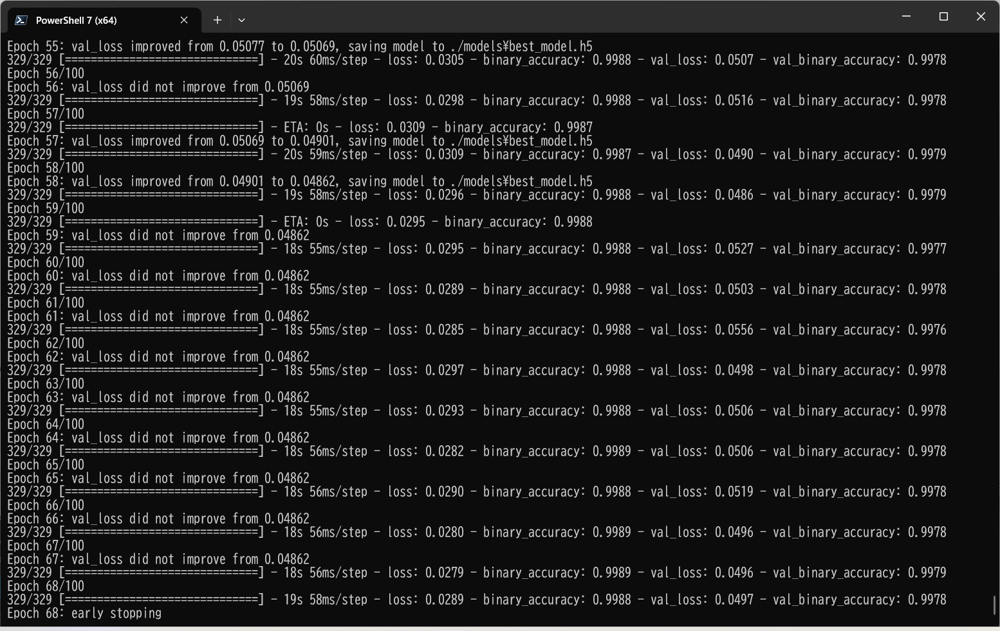 
 

  
The <b>val_binary_accuracy</b> is very high as shown below from the beginning of the training. 
<b>Train metrics line graph</b>: 
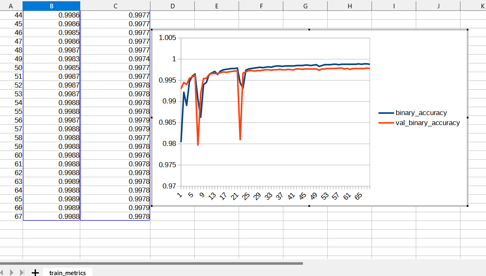 

 
The val_loss is also very low as shown below from the beginning of the training. 
<b>Train losses line graph</b>: 
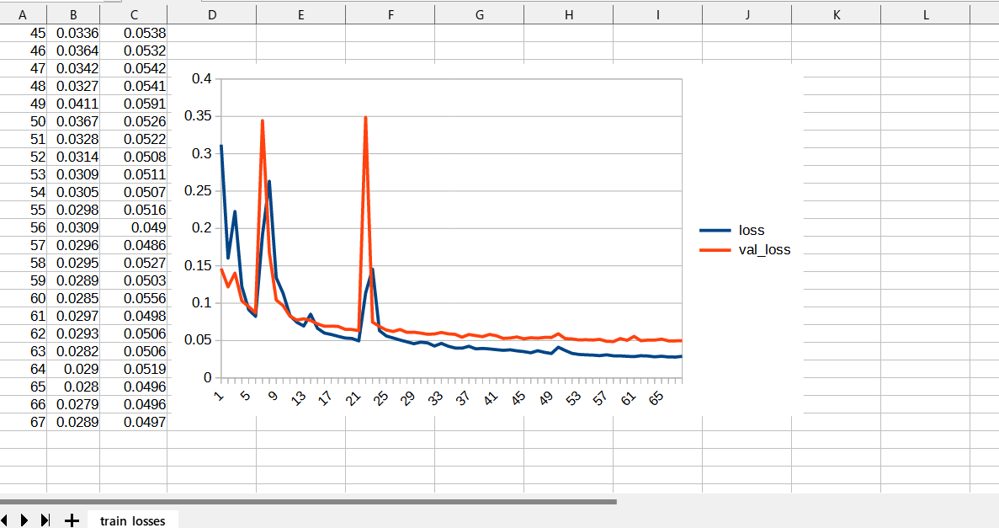 

<h2>
4 Evaluation
</h2>
 We have evaluated prediction accuracy of our Pretrained MultipleMyeloma Model by using <b>test</b> dataset.
Please move to ./projects/MultipleMyeloma directory, and run the following bat file. 
<pre>
>2.evalute.bat
</pre>
, which simply run the following command. 
<pre>
>python ../../TensorflowUNetEvaluator.py train_eval_infer.config
</pre>
The evaluation result of this time is the following. 
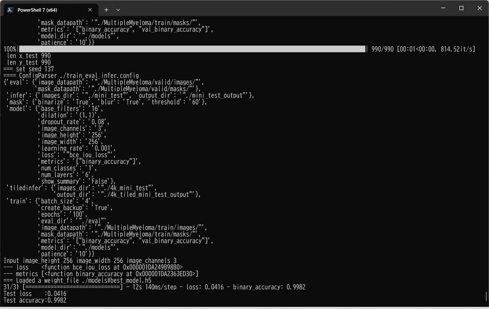 
 

<!--
-->
<h2>
5 Tiled Image Segmentation
</h2>
By using Python script <a href="./projects/MultipleMyeloma/resize4k.py">resize4k.py</a>,
we have created 4K size <b>4k_mini_test</b> dataset, which is a set of 4K size images
created from the original 2.5K image bmp dataset in the following <b>x</b> images folder:
<pre>
TCIA_SegPC_dataset
└─test
    └─x
</pre>

Please move to ./projects/MultipleMyeloma directory, and run the following bat file. 
<pre>
>4.tiled_infer.bat
</pre>
, which simply runs the following command. 
<pre>
>python ../../TensorflowUNetTiledInfer.py train_eval_infer.config
</pre>
This Python script performs <b>Tiled-Image-Inference</b> based on the directory settings in 
in following <b>tiledinfer</b> section,

<pre>
[tiledinfer] 
images_dir = "./4k_mini_test"
output_dir = "./4k_tiled_mini_test_output"
</pre>

The TensorflowUNetTiledInfer.py script performs the following processings for each 4K image file. 
<pre>
1 Read a 4K image file in images_dir folder.
2 Split the image into multile tiles by image size of Model.
3 Infer for all tiled images.
4 Merge all inferred mask,
</pre>
Currently, we don't support <b>Seamless Smooth Stitching</b> on the mask merging process.  
 
See also:
<b>Tiling and stitching segmentation output for remote sensing: basic challenges and recommendations</b> 
<pre>
https://arxiv.org/ftp/arxiv/papers/1805/1805.12219.pdf
</pre>

For example, 4K image file in 4k_mini_test will be split into a lot of pieces of tiled split images as shown below; 
<b>4K 405.jpg</b> 
  
<b>Tiled split images </b> 
 

 

<b>Input 4K images (4k_mini_test) </b> 
 
 
<b>Infered 4K images (4k_mini_test_output)</b> 
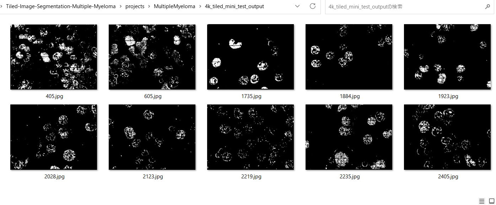  
 

<b>Detailed 4K images comarison:</b> 
<table>
<tr><td>4k_mini_test/405.jpg</td><td>Inferred_image</td></tr>
<tr>
<td></td>
<td>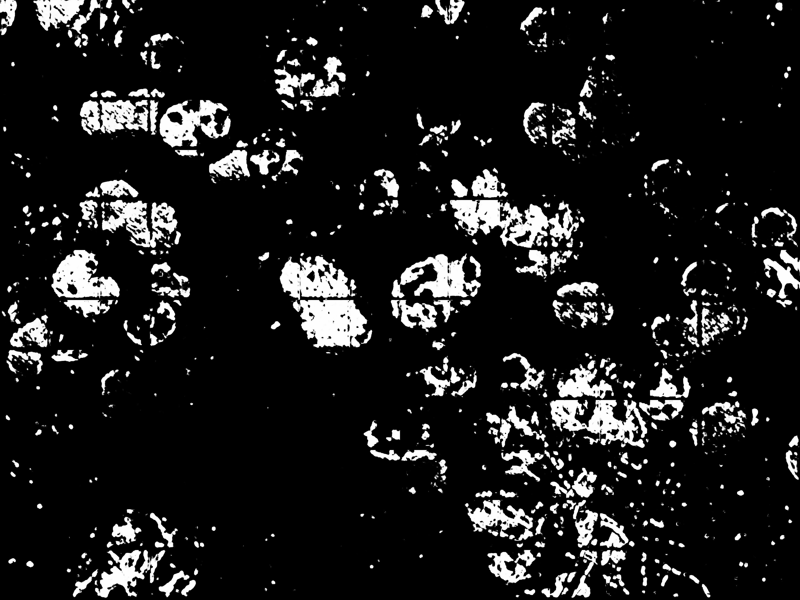</td>
</tr>
<tr><td>4k_mini_test/605.jpg</td><td>Inferred_image</td></tr>

<tr>
<td></td>
<td>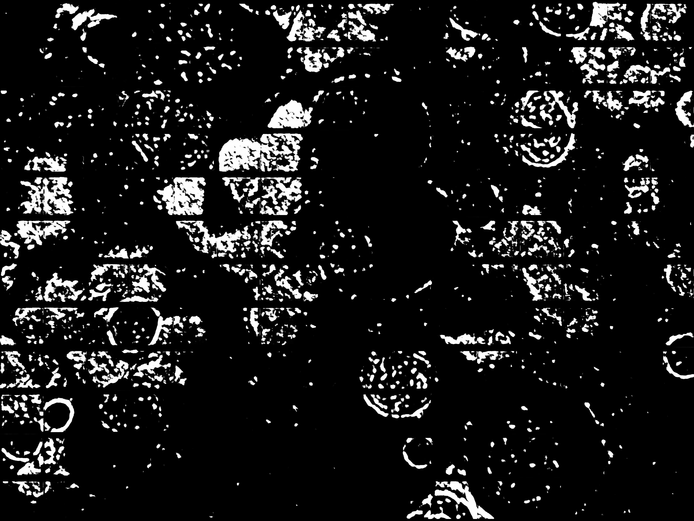</td>
</tr>

<tr><td>4k_mini_test/1735.jpg</td><td>Inferred_image</td></tr>

<tr>
<td></td>
<td>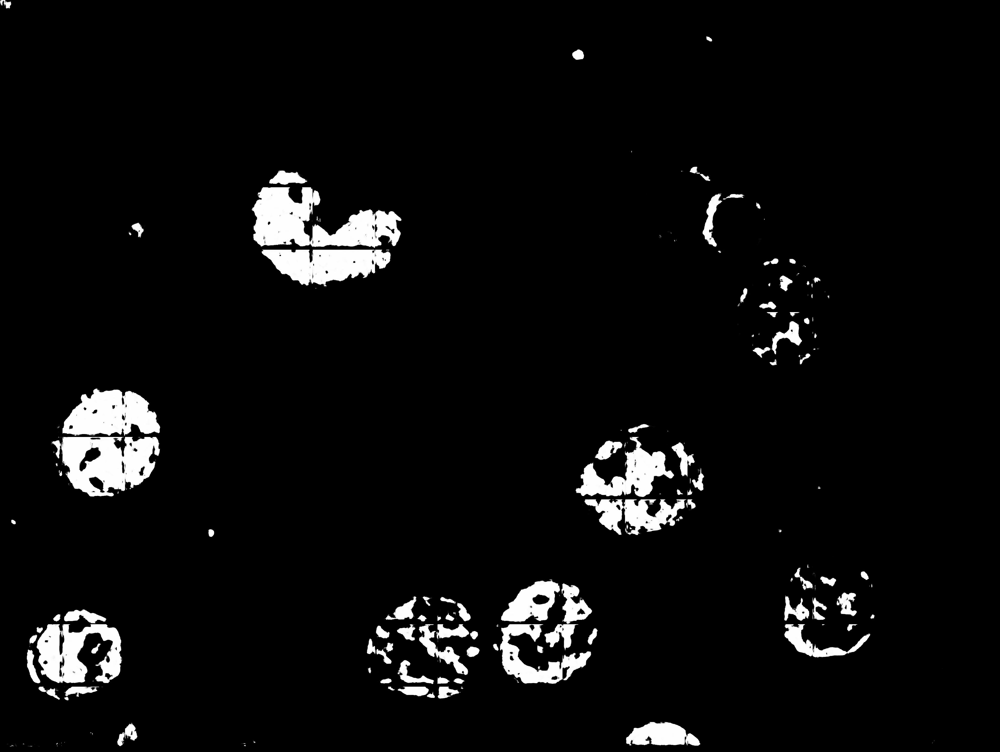</td>
</tr>

<tr><td>4k_mini_test/1923.jpg</td><td>Inferred_image</td></tr>

<tr>
<td></td>
<td>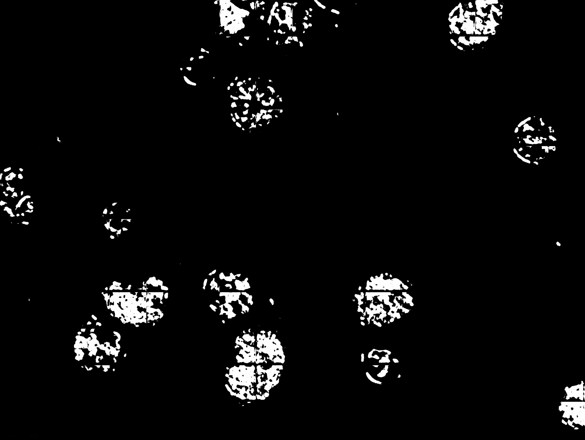</td>
</tr>

<tr><td>4k_mini_test/2028.jpg</td><td>Inferred_image</td></tr>

<tr>
<td></td>
<td>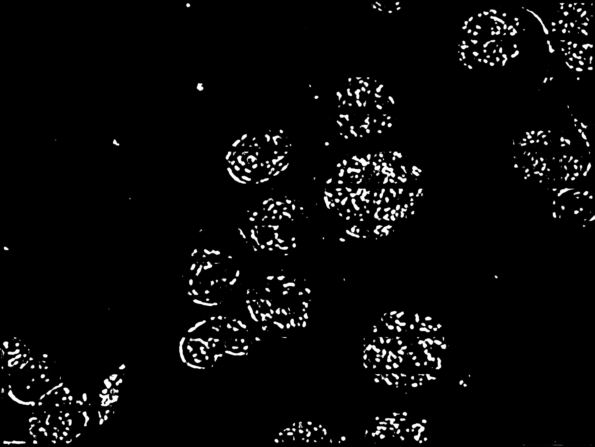</td>
</tr>

</table>
 

<h2>
6 Improve Tiled Image Segmentation
</h2>
How to improve detection accuracy of our Tiled-Image-Segmentation Model? 
At least, it is much better to increase the image size of our UNet Model from 256x256 to 512x512.
We only have to chanage the configuration file <b>train_eval_infer.config</b> as shown below, and retrain the our UNetModel. 
<pre>
; train_eval_infer_512x512.config
[model]
image_width    = 512
image_height   = 512
</pre>
<h3>1 Training 512x512 model</h3>
Please move to ./projects/MultipleMyeloma directory, and run the following train bat file. 
<pre>
>201.train.bat
</pre>
, which simply runs the following command. 
<pre>
>python ../../TensorflowUNetTrainer.py ./train_eval_infer_255x255.config
</pre>
<h3>2 Inference by 512x512 model</h3>
<pre>
>204.tiled_infer.bat
</pre>
, which simply runs the following command. 
<pre>
>python ../../TensorflowUNetTiledInfer.py ./train_eval_infer_512x512.config
</pre>

We are able to get slightly clear better inference results as shown below. 

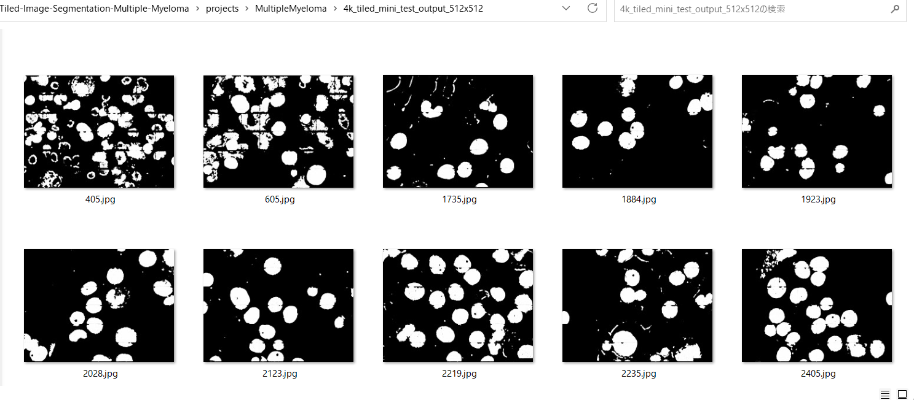 
 
<b>Detailed 4K images comarison:</b> 
<table>

<tr><td>4k_mini_test/405.jpg</td><td>Inferred_image</td></tr>
<tr>
<td></td>
<td>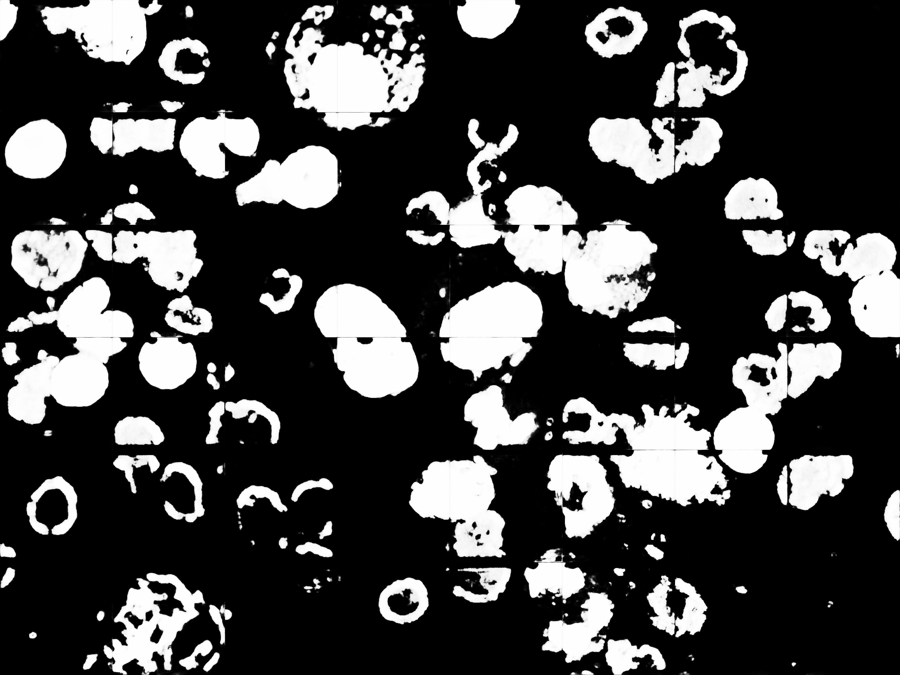</td>
</tr>
<tr><td>4k_mini_test/605.jpg</td><td>Inferred_image</td></tr>

<tr>
<td></td>
<td>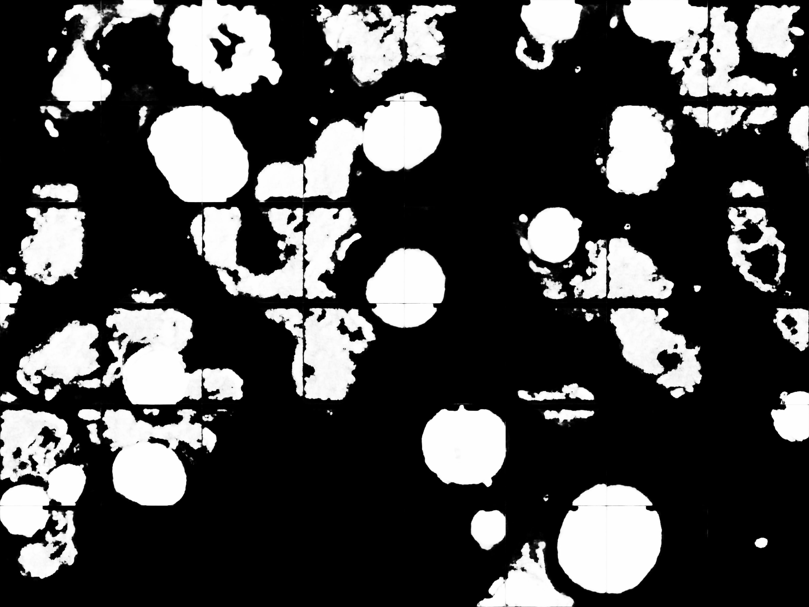</td>
</tr>

<tr><td>4k_mini_test/1735.jpg</td><td>Inferred_image</td></tr>

<tr>
<td></td>
<td>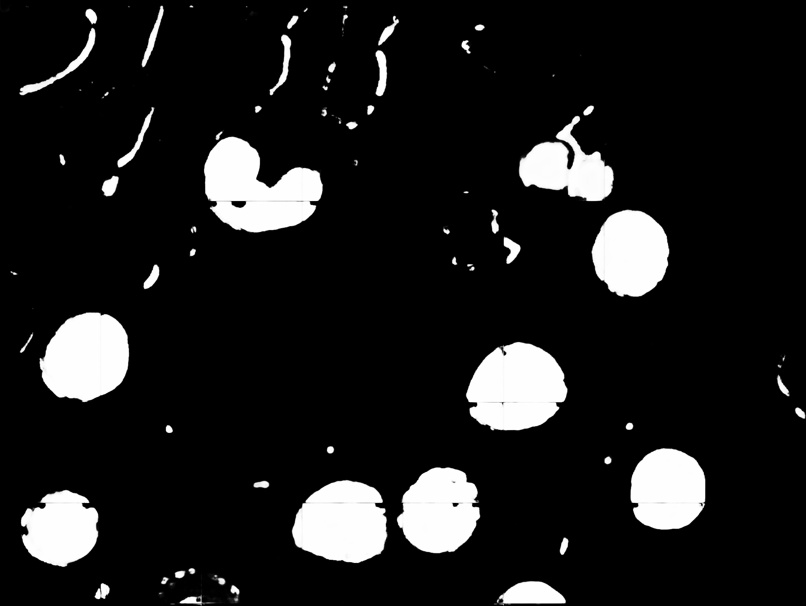</td>
</tr>

<tr><td>4k_mini_test/1923.jpg</td><td>Inferred_image</td></tr>

<tr>
<td></td>
<td></td>
</tr>

<tr><td>4k_mini_test/2028.jpg</td><td>Inferred_image</td></tr>

<tr>
<td></td>
<td>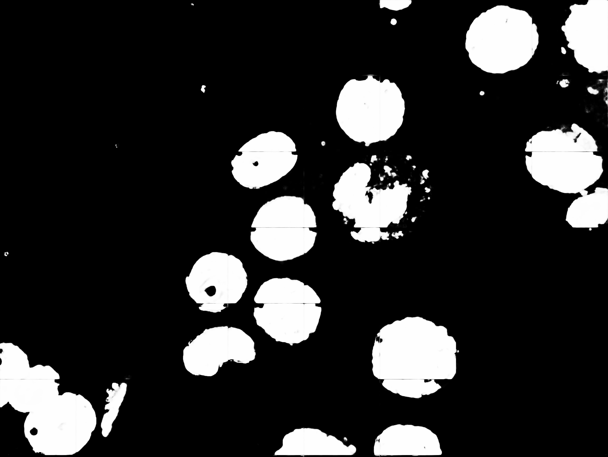</td>
</tr>

</table>

<h2>
7 Non Tiled Image Segmentation
</h2>
For comparison, please move to ./projects/MultipleMyeloma directory, and run the following bat file. 
<pre>
>3.infer.bat
</pre>
, which simply runs the following command. 
<pre>
>python ../../TensorflowUNetInfer.py train_eval_infer.config
</pre>
This Python script performs <b>Non-Tiled-Image-Inference</b> based on the directory settings in 
in following <b>infer</b> section,
 <pre>
[infer] 
images_dir    = "./mini_test" 
output_dir    = "./mini_test_output"
</pre>
In this case, the images_dir in that section contains 2.5K image files taken from
<pre>
TCIA_SegPC_dataset
└─test
    └─x
</pre>

<b>Input images (mini_test) </b> 
 
 
<b>Infered images (mini_test_output)</b> 
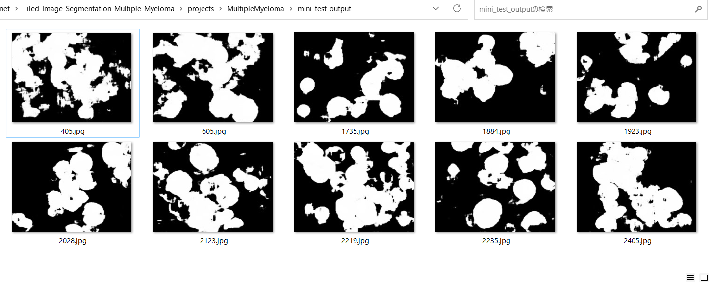  
 
<b>Detailed images comarison:</b> 
<table>
<tr><td>mini_test/405.jpg</td><td>Inferred_image</td></tr>
<tr>
<td></td>
<td>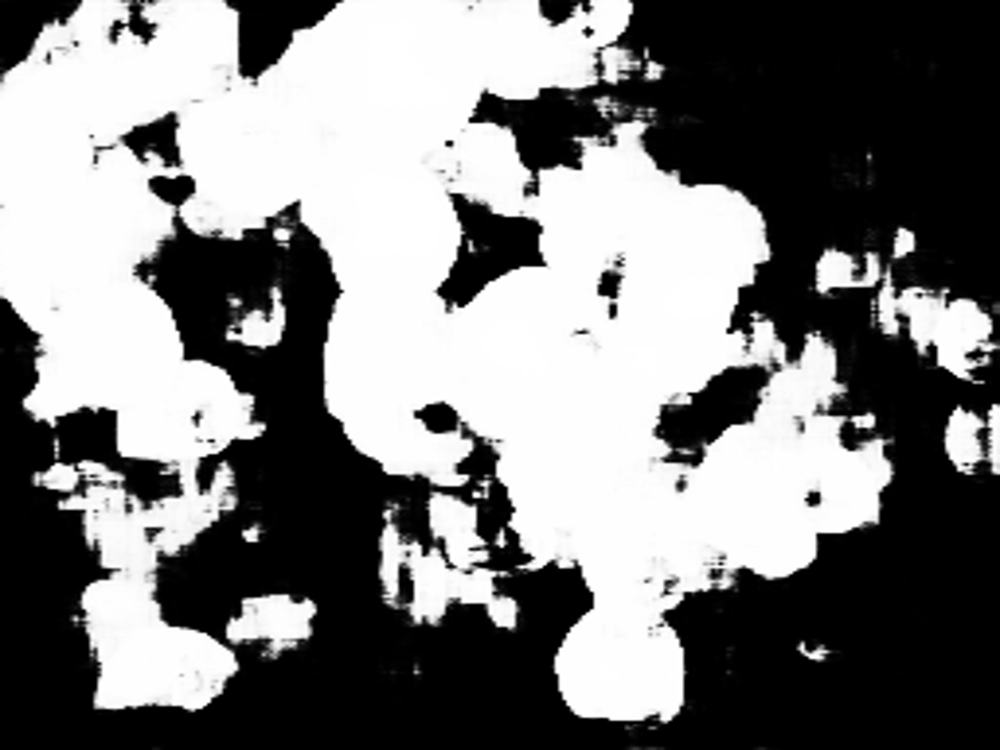</td>
</tr>
<tr><td>mini_test/605.jpg</td><td>Inferred_image</td></tr>

<tr>
<td></td>
<td>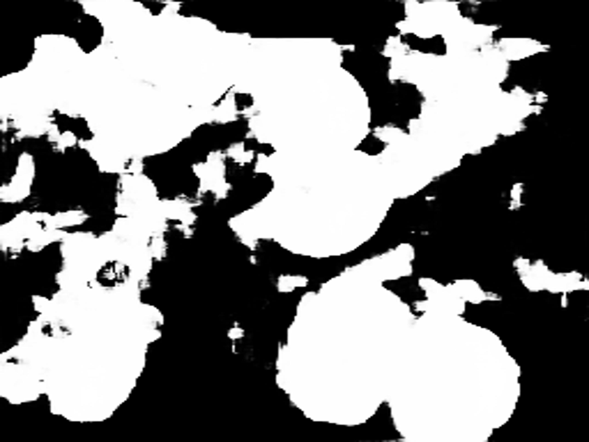</td>
</tr>

<tr><td>mini_test/1735.jpg</td><td>Inferred_image</td></tr>

<tr>
<td></td>
<td>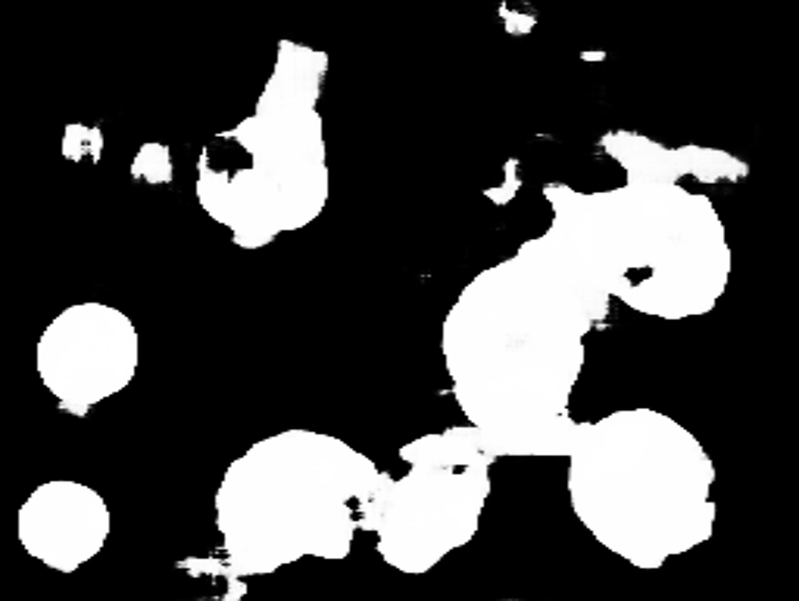</td>
</tr>

<tr><td>mini_test/1923.jpg</td><td>Inferred_image</td></tr>

<tr>
<td></td>
<td>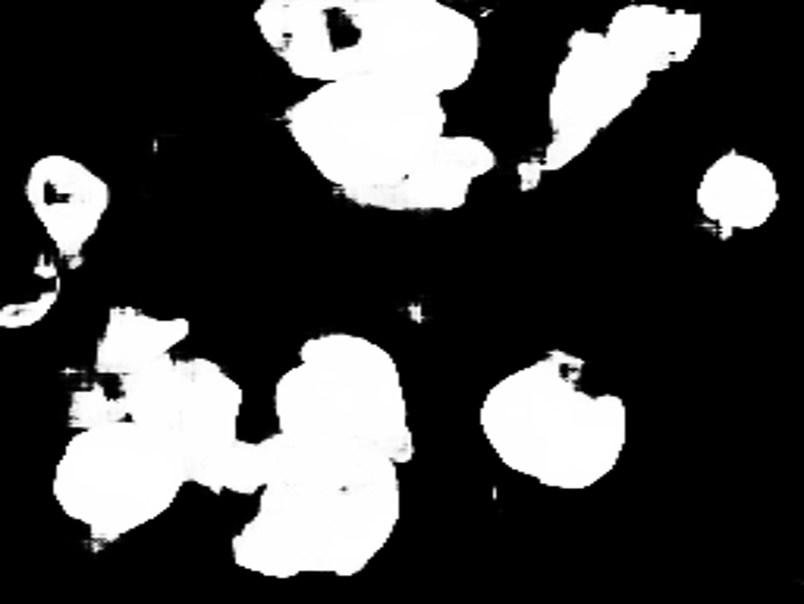</td>
</tr>

<tr><td>mini_test/2028.jpg</td><td>Inferred_image</td></tr>

<tr>
<td></td>
<td>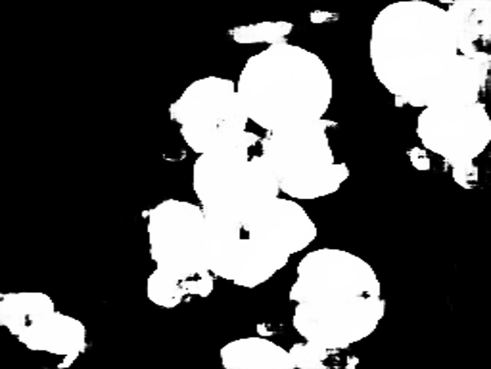</td>
</tr>

</table>

<h3>
References
</h3>
<b>1. SegPC-2021-dataset</b> 
SegPC-2021: Segmentation of Multiple Myeloma Plasma Cells in Microscopic Images 
<pre>
https://www.kaggle.com/datasets/sbilab/segpc2021dataset
</pre>
Citation: 
<pre>
Anubha Gupta, Ritu Gupta, Shiv Gehlot, Shubham Goswami, April 29, 2021, "SegPC-2021: Segmentation of Multiple Myeloma Plasma Cells 
in Microscopic Images", IEEE Dataport, doi: https://dx.doi.org/10.21227/7np1-2q42.
BibTex
@data{segpc2021,
doi = {10.21227/7np1-2q42},
url = {https://dx.doi.org/10.21227/7np1-2q42},
author = {Anubha Gupta; Ritu Gupta; Shiv Gehlot; Shubham Goswami },
publisher = {IEEE Dataport},
title = {SegPC-2021: Segmentation of Multiple Myeloma Plasma Cells in Microscopic Images},
year = {2021} }
IMPORTANT:
If you use this dataset, please cite below publications-
1. Anubha Gupta, Rahul Duggal, Shiv Gehlot, Ritu Gupta, Anvit Mangal, Lalit Kumar, Nisarg Thakkar, and Devprakash Satpathy, 
 "GCTI-SN: Geometry-Inspired Chemical and Tissue Invariant Stain Normalization of Microscopic Medical Images," 
 Medical Image Analysis, vol. 65, Oct 2020. DOI: 
 (2020 IF: 11.148)
2. Shiv Gehlot, Anubha Gupta and Ritu Gupta, 
 "EDNFC-Net: Convolutional Neural Network with Nested Feature Concatenation for Nuclei-Instance Segmentation,"
 ICASSP 2020 - 2020 IEEE International Conference on Acoustics, Speech and Signal Processing (ICASSP), 
 Barcelona, Spain, 2020, pp. 1389-1393.
3. Anubha Gupta, Pramit Mallick, Ojaswa Sharma, Ritu Gupta, and Rahul Duggal, 
 "PCSeg: Color model driven probabilistic multiphase level set based tool for plasma cell segmentation in multiple myeloma," 
 PLoS ONE 13(12): e0207908, Dec 2018. DOI: 10.1371/journal.pone.0207908
License
CC BY-NC-SA 4.0
</pre>

<b>2. Deep Learning Based Approach For MultipleMyeloma Detection</b> 
Vyshnav M T, Sowmya V, Gopalakrishnan E A, Sajith Variyar V V, Vijay Krishna Menon, Soman K P 
<pre>
https://www.researchgate.net/publication/346238471_Deep_Learning_Based_Approach_for_Multiple_Myeloma_Detection
</pre>
 
<b>3. EfficientDet-Multiple-Myeloma</b> 
Toshiyuki Arai @antillia.com 
<pre>
https://github.com/sarah-antillia/EfficientDet-Multiple-Myeloma</pre>
 

<b>4. Image-Segmentation-Multiple-Myeloma</b> 
Toshiyuki Arai @antillia.com 
<pre>
https://github.com/atlan-antillia/Image-Segmentation-Multiple-Myeloma
</pre>
 

<b>5. The revolutionary benefits of 4K in healthcare</b> 
SONY 
<pre>
https://pro.sony/en_CZ/healthcare/imaging-innovations-insights/operating-room-4k-visualisation
</pre>
 

<b>6. Three Reasons to Use 4K Endoscopy and Surgical Monitors</b> 
EIZO 
<pre>
https://www.eizo.com/library/healthcare/reasons-to-use-4k-surgical-and-endoscopy-monitors/
</pre>
 

<!-- 
  -->

<b>7. Systematic Evaluation of Image Tiling Adverse Effects on Deep Learning Semantic Segmentation</b> 
G. Anthony Reina1, Ravi Panchumarthy, Siddhesh Pravin Thakur,  
Alexei Bastidas1 and Spyridon Bakas 
<pre>
https://www.frontiersin.org/articles/10.3389/fnins.2020.00065/full</pre>
 

<b>8. Tiling and stitching segmentation output for remote sensing: basic challenges and recommendations</b> 
Bohao Huang, Daniel Reichman, Leslie M. Collins 
, Kyle Bradbury, and Jordan M. Malof 
<pre>
https://arxiv.org/ftp/arxiv/papers/1805/1805.12219.pdf
</pre>
 

